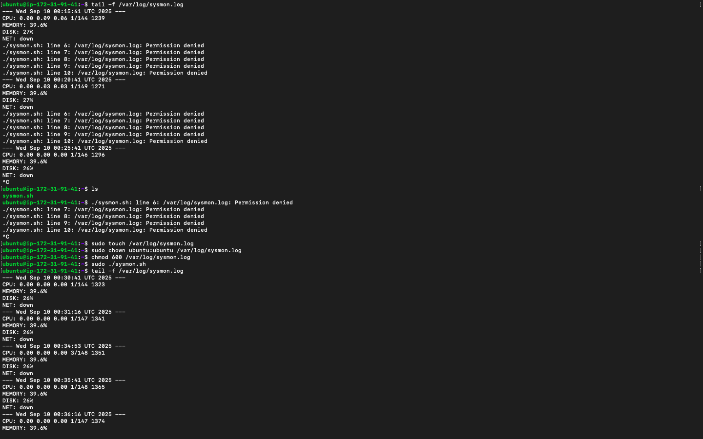

[](https://classroom.github.com/a/NENsd3bP)
[](https://classroom.github.com/online_ide?assignment_repo_id=20397257&assignment_repo_type=AssignmentRepo)

# Linux System Monitoring on AWS

This project implements a system monitoring script deployed on AWS EC2.

## AWS Deployment

### Why AWS?

I'm always having issues with my hardware - not enough RAM, which drags my system down. That's why I used AWS EC2 for this project.

### Setup

1. Launched an EC2 instance on AWS
2. SSH'd into the instance using:
   ```bash
   ssh -i <your-key.pem> ec2-user@<your-ec2-ip>
   ```
3. Set up the log file with proper permissions:

   ```bash
   # Create the file as root
   sudo touch /var/log/sysmon.log

   # Give ownership to your user (ubuntu)
   sudo chown ubuntu:ubuntu /var/log/sysmon.log

   # Restrict permissions so only you can read/write
   chmod 600 /var/log/sysmon.log
   ```

4. Deployed the system monitoring script

### System Monitor (sysmon.sh)

A background script that monitors:

- CPU load average
- Memory usage
- Disk usage
- Network interface status

Logs are written to `/var/log/sysmon.log` every 5 minutes.

### Usage

```bash
# Make executable
chmod +x sysmon.sh

# Run the monitor
./sysmon.sh

# View logs
tail -f /var/log/sysmon.log
```

## Files

- `sysmon.sh` - System monitoring script

# Here’s the system monitoring flow:


